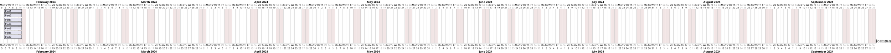

# TOEIC 700点
- 総時間：255時間
- 合計時間：10時間
- 毎日：1時間30分

## 配分
- Part1：8時間
- Part2：17時間
- Part3：45時間
- Part4：45時間
- Part5：20時間
- Part6：60時間
- Part7：60時間
  
## スケジュール

```plantuml
@startgantt
Project starts 2024-2-5
saturday are closed
sunday are closed
[Part1] starts 2024-02-06
[Part1] ends 2024-02-10
[Part2] starts 2024-02-06
[Part2] ends 2024-02-10
[Part3] starts 2024-02-06
[Part3] ends 2024-02-10
[Part4] starts 2024-02-06
[Part4] ends 2024-02-10
[Part5] starts 2024-02-06
[Part5] ends 2024-02-10
[Part6] starts 2024-02-06
[Part6] ends 2024-02-10
[Part7] starts 2024-02-06
[Part7] ends 2024-02-10
[TOEIC試験日] starts 2024-09-29
[TOEIC試験日] ends 2024-09-29
@endgantt
```
